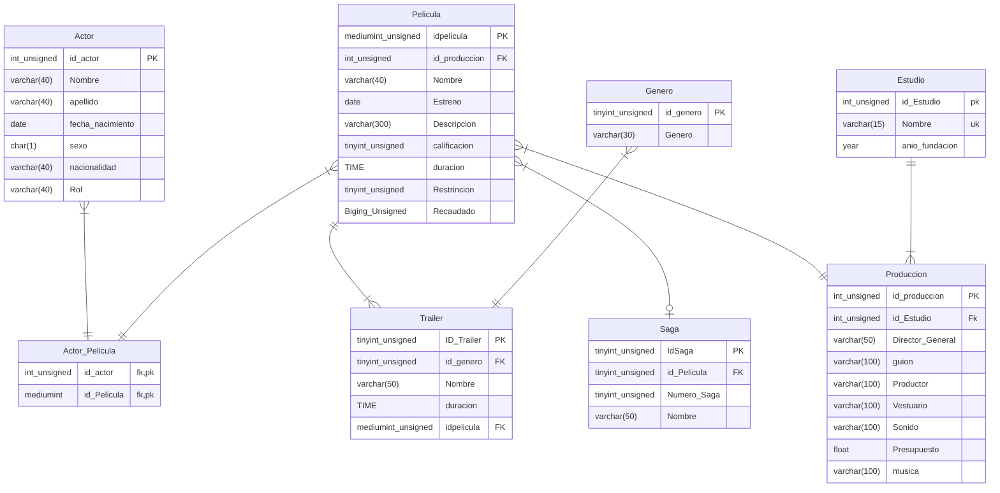

```mermaid
erDiagram
Pelicula{
mediumint_unsigned idpelicula PK
int_unsigned id_produccion FK
varchar(40) Nombre
date Estreno
varchar(300) Descripcion
tinyint_unsigned calificacion
TIME duracion
tinyint_unsigned Restrincion
Biging_Unsigned Recaudado
}
Produccion{
int_unsigned id_produccion PK
int_unsigned  id_Estudio Fk
varchar(50) Director_General
varchar(100) guion
varchar(100) Productor
varchar(100) Vestuario
varchar(100) Sonido
float Presupuesto
varchar(100) musica
}
Trailer{
   tinyint_unsigned ID_Trailer PK
   tinyint_unsigned id_genero FK
   varchar(50) Nombre
   TIME duracion
   mediumint_unsigned idpelicula FK
}
Genero{
   tinyint_unsigned id_genero PK
   varchar(30) Genero
}
Saga{
   tinyint_unsigned IdSaga PK
   tinyint_unsigned id_Pelicula FK
   tinyint_unsigned Numero_Saga
   varchar(50) Nombre
}
Actor{
   int_unsigned id_actor PK
   varchar(40) Nombre
   varchar(40) apellido
   date fecha_nacimiento
   char(1) sexo
   varchar(40) nacionalidad
   varchar(40) Rol
}
Actor_Pelicula{
   int_unsigned id_actor fk,pk
   mediumint id_Pelicula fk,pk
}
Estudio{
   int_unsigned id_Estudio pk
   varchar(15) Nombre uk
   year anio_fundacion
}
Actor}|--||Actor_Pelicula:""
Pelicula}|--||Actor_Pelicula:""
Pelicula||--}|Trailer:""
Pelicula}|--o|Saga:""
Pelicula}|--||Produccion:""
Estudio||--|{Produccion:""
Genero}|--||Trailer:""
```
