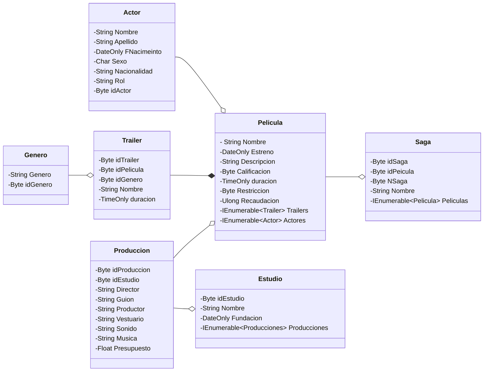

## Docu Cine

### Diagrama de clases

```mermaid

classDiagram
direction RL

class Pelicula {
    - String Nombre
   -DateOnly Estreno
   -String Descripcion
   -Byte Calificacion
   -TimeOnly duracion
   -Byte Restriccion
   -Ulong Recaudacion
   -IEnumerable~Trailer~ Trailers
   -IEnumerable~Actor~ Actores
}


class Actor {
   -String Nombre
   -String Apellido
   -DateOnly FNacimeinto
   -Char Sexo
   -String Nacionalidad
   -String Rol
   -Byte idActor
}


class Saga {
   -Byte idSaga
   -Byte idPeicula
   -Byte NSaga
   -String Nombre
   -IEnumerable~Pelicula~ Peliculas
}


class Genero {
   -String Genero
   -Byte idGenero
}


class Trailer {
   -Byte idTrailer
   -Byte idPelicula
   -Byte idGenero
   -String Nombre
   -TimeOnly duracion
}


class Produccion {
   -Byte idProduccion
   -Byte idEstudio
   -String Director
   -String Guion
   -String Productor
   -String Vestuario
   -String Sonido
   -String Musica
   -Float Presupuesto
}


class Estudio {
   -Byte idEstudio
   -String Nombre
   -DateOnly Fundacion
   -IEnumerable~Producciones~ Producciones
}

   Saga o-- Pelicula
   Pelicula o-- Actor
   Trailer o--Genero
   Pelicula *--Trailer
   Pelicula o-- Produccion
   Estudio o-- Produccion

```
